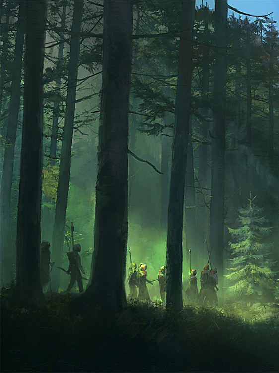

# Cyber

如果你来到这里，不妨读一读这段小故事。这个架空世界的过往。赛博过往。

## 起源

一名身着白大褂的男人静静的站在窗外，眼神凝视着隔离窗内的女孩。女孩口中插着氧气管，一旁的心电仪滴滴的响着。

心电图上的功率越发的慢了下来。但是女孩惨白的脸庞里，彷佛微微的动了起来。似乎在呼唤些什么。

“利兹，爸爸在这”

男子下意识的伸手想回应女孩。但触碰到的只有冰冷的玻璃。

男子咬了一下下嘴唇。

“利兹，放心睡吧。那个世界不可怕。醒来以后，爸爸妈妈都会在那里等你。”

话音刚落不久，心电图的浪波彻底消失了。留下的只有长长的一声“滴”。

男子回过头，还有.....另一个男人的身影。

------

## 孤儿

圣托利亚历1067年，洛恩帝国东境。

“康纳，汇报一下伤亡情况。”

“是，奥托殿下。我部阵亡27人，受伤56人。全歼敌部256人。目前正在打扫战场。”

“父亲那边有没有什么消息。”

“公爵大人并没有消息。按日子算。已经到了海港城了。”

奥托从马上取来一带水，喝了一大口。

战斗从昨夜一直打到早上，他已经是筋疲力竭了。

更何况他是长途奔袭。更是累的不行。但也正因为这一出奇兵，才获得这场战斗的大胜。

“算前两次的战斗，这次的东部叛乱算是解决了。”

不知是严重脱水的缘故，还是什么原因。恍惚之中，他看到远处的森林出现了一道白光。

他顺着白光而去。

白光最终停在了一棵苍天大树之下。

一个婴儿正在那里平静的睡着。

这一天，奥托收养了一个男孩。为他取名弗兰.维兹（白鹿之子）

------

## 分裂

圣托利亚历元年，巴别岛

托利亚和他的子女们做好了充足的准备，粮食，水源。登上了他们做好的船。

和梦里的所看见的一样。

天空开始撕裂，倾盆大雨从天而降。

大地开始撕裂，有罪的人们都陷了下去。

唯有他们的小船浮了上来。

遵照着指示，他们一直向东驶去。

如果远远望去，还能看见那高耸入天的高塔。无数的人跌落。

渐行渐远后，高塔消失在重重浓雾之下，再也看不到了。

------

## 狩猎

圣托利亚历1082年

只听的嗖的一声。一支利箭从灌木丛中飞出，命中目标。

“忠诚，快上。”一声坚决的命令随后传来。

紧接着，一只猎犬冲上去。扑倒了中箭的公鹿。

“太好了，叔父。抓住了。”一旁的传来了一名少年的欢呼。

一名气宇不凡的中年男子，放下手中的弓，摸了摸一旁少年的头。轻轻地说道

“弗兰，和我过来。”

紧接着男子走向公鹿，少年在一旁跟随着。

男子走到猎物跟前，跪在猎物面前，轻轻地祷告着：“感谢大自然给我们的恩赐。请安息吧”

少年在一旁也跟着做到。

待祷告完毕。男子，才取出匕首，捂住公鹿的双眼，结束了它的生命。

男子做完后，转而对少年说道

“永远要尊敬大自然。弗兰。你要知道，这不是应得的。是这片森林留给我们的。拿走的东西，你也要还给它些什么。”

------

