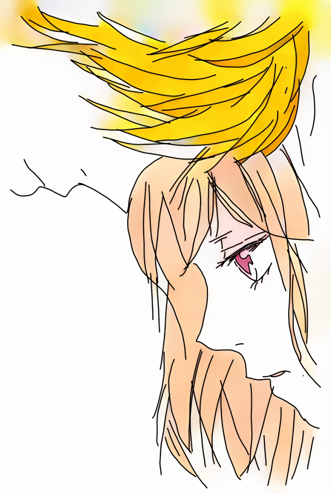

# Cyber

如果你来到这里，不妨读一读这段小故事。这个架空世界的过往。赛博过往。

## 起源

一名身着白大褂的男人静静的站在窗外，眼神凝视着隔离窗内的女孩。女孩口中插着氧气管，一旁的心电仪滴滴的响着。

心电图上的功率越发的慢了下来。但是女孩惨白的脸庞里，彷佛微微的动了起来。似乎在呼唤些什么。

“利兹，爸爸在这”

男子下意识的伸手想回应女孩。但触碰到的只有冰冷的玻璃。

男子咬了一下下嘴唇。

“利兹，放心睡吧。那个世界不可怕。醒来以后，爸爸妈妈都会在那里等你。”

话音刚落不久，心电图的浪波彻底消失了。留下的只有长长的一声“滴”。

男子回过头，还有.....另一个男人的身影。

------

## 孤儿

圣托利亚历1067年，洛恩帝国东境。

“康纳，汇报一下伤亡情况。”

“是，奥托殿下。我部阵亡27人，受伤56人。全歼敌部256人。目前正在打扫战场。”

“父亲那边有没有什么消息。”

“公爵大人并没有消息。按日子算。已经到了海港城了。”

奥托从马上取来一带水，喝了一大口。

战斗从昨夜一直打到早上，他已经是筋疲力竭了。

更何况他是长途奔袭。更是累的不行。但也正因为这一出奇兵，才获得这场战斗的大胜。

“算前两次的战斗，这次的东部叛乱算是解决了。”

不知是严重脱水的缘故，还是什么原因。恍惚之中，他看到远处的森林出现了一道白光。

他顺着白光而去。

白光最终停在了一棵苍天大树之下。

一个婴儿正在那里平静的睡着。

这一天，奥托收养了一个男孩。为他取名弗兰.维兹（白鹿之子）

------

## 分裂

圣托利亚历元年，巴别岛

托利亚和他的子女们做好了充足的准备，粮食，水源。登上了他们做好的船。

和梦里的所看见的一样。

天空开始撕裂，倾盆大雨从天而降。

大地开始撕裂，有罪的人们都陷了下去。

唯有他们的小船浮了上来。

遵照着指示，他们一直向东驶去。

如果远远望去，还能看见那高耸入天的高塔。无数的人跌落。

渐行渐远后，高塔消失在重重浓雾之下，再也看不到了。

------

## 狩猎

圣托利亚历1082年

只听的嗖的一声。一支利箭从灌木丛中飞出，命中目标。

“忠诚，快上。”一声坚决的命令随后传来。

紧接着，一只猎犬冲上去。扑倒了中箭的公鹿。

“太好了，叔父。抓住了。”一旁的传来了一名少年的欢呼。

一名气宇不凡的中年男子，放下手中的弓，摸了摸一旁少年的头。轻轻地说道

“弗兰，和我过来。”

紧接着男子走向公鹿，少年在一旁跟随着。

男子走到猎物跟前，跪在猎物面前，轻轻地祷告着：“感谢大自然给我们的恩赐。请安息吧”

少年在一旁也跟着做到。

待祷告完毕。男子，才取出匕首，捂住公鹿的双眼，结束了它的生命。

男子做完后，转而对少年说道

“永远要尊敬大自然。弗兰。你要知道，这不是应得的。是这片森林留给我们的。拿走的东西，你也要还给它些什么。”

------

## 兄弟

圣托利亚历13年

年迈的托利亚，弥留之际，回忆起了自己走过的一生。遵循着梦里一步一步的指示，离开了那个高塔，逃离洪水天灾。

来到了这块大陆。建立了自己的城市。

他叫来自己的三个儿子。

“法洛克，洛恩，萨斯。在我死后，你们各自向着大陆的三个方向搬迁。不要生活在一块，天灾来了，你们就不会都死亡。”

在父亲死后，三兄弟私下决定，大哥法洛克向西，老二洛恩向东，老三萨斯向南。他们分别带着自己的追随者建立了自己的城市。

------

## 蔷薇

法洛克一行人从托利亚城向西而去。

跨过山丘，丛林。

一路的奔波，让他们的粮食和水源都快耗尽了。

终于，他们来到了一处平原。

令他们无比惊叹的情景出现了。

横亘平原的有一条无比清澈的河。

河岸边有一棵苍天巨树，上面开满了金色的蔷薇花。

他们在河边取水，捕鱼。在树下乘凉。

有赖于这一苍天巨树。法洛克一行人得以活了下来。

他们决定留在此处。建立自己的家园。

------

## 恩惠

洛恩一行人向东而去。

他们在路上遇上了一只受伤的白鹿。

虽然粮食和药物并不多，他们还是选择帮助他。

然后继续向东而去。

但是，他们在一处丛林里迷路。

三天三夜。

身上带的水和粮食都吃完了。洛恩感到了绝望。

第三天夜里，洛恩从梦中醒来。他看到一只白光。

似乎在呼唤他，他跟随而去。

顺着白光，他找到了森林的出路。

看到了小溪和满是果实的果树。

洛恩带着族人而来，他们得救了。

洛恩相信这是那头白鹿的恩惠。他们在此处定居。

洛恩告诉自己的子嗣，要对森林永怀尊敬与感激。

危难来临时，白鹿会再次出现帮助他们。

------

## 海岸

萨斯一行人向南而去

南方河网密布

东方森林分布

西方平原广阔

萨斯沿途，遇水而捕。

食物与水源并不成问题

但是由于河网密集，他们行途困难。

一天，萨斯在渡过一条河的途中，遇到了水涡。

一行人被卷入水中，几乎淹死。

他们在慌忙中，抓住了一块木桩。惊奇的是，这只木桩竟然能承受住所有的人的重量。

由此他们得救了。他们由此开始研究这个木桩。

沿途的河边生长着许多这样的树。这样的木头，浮力极强。

萨斯决定定居于此，取此木为舟，得以在河网顺畅通行

------

## 遗落

神圣洛恩帝国，恩惠节。

洛恩为了纪念当年白鹿的恩惠。

每年秋季，夜空里那颗星达到最亮的时候。

洛恩国王召集各地的领主来到白鹿城。男人狩猎，女人摘果。

举办盛大的庆祝典礼。庆祝这个日子。

经过几百年的发展，这个节日逐渐也成为男人证明自己能力的节日。

收获最多的人，将在这天，在全国所有领主的见证下，得到国王的嘉奖。

圣托利亚历500年，也即托利亚来到新大陆的500年后。

国王洛恩十三世，年轻气盛。

为了证明自己的实力，在恩惠节这天，亲自参与狩猎。

狩猎当天，一只白鹿出现在他的眼前。

惊喜万分的他，追随着白鹿。

进入了深林的深处。

再也没有出来过。

由于没有子嗣，洛恩帝国丧失王位继承人。

当时的七个实力最强的领主将帝国分裂成七大王国。东面的波希米亚，普洛斯，西面的博戈蒂北面的洛林，南面的拜恩，以及东西两个非世俗国美茵兹、科尔。

民间流传着这样的传说，洛恩王接受白鹿的指引，前往了绝美的圣地。终有一天，王会骑着白鹿回到王国。

------

## 母亲

“殿下，这个孩子是？”康纳看着奥托抱着一个婴儿从森林深处回来。

“他叫弗兰.维兹。是白鹿带我找到他的。”

“您看到了白鹿？”康纳惊得楞了许久，随即又问道，

“但这个可能是叛军的人的孩子，要是被普洛斯王知道了，可就麻烦了，不如以绝后患”。

“康纳，这是白鹿的旨意。我注定要收养这个孩子。”奥托的语气里透露出坚定。

“是，属下明白了。”

“你去叫伊莲娜来。”奥托犹豫了一会，说道。

“是，我这就去找殿下。”

伊莲娜，军队里的女医师。当时西境之王博戈蒂国王的女儿。也是奥托的未婚妻。

不一会，一个女医师跟着康纳来到奥托身边。

“我那边还有很多伤员要处理。还请快些。有什么吩咐吗？奥托殿下。”女子显然是刚从治疗现场过来，白色衣服上沾了些许伤员的血。

“这个孩子，我能托付给你吗?”奥托看着手里的孩子，转而抬头对伊莲娜说道。

“这个孩子是？”

“白鹿之子。他的名字叫弗兰.维兹。”

女子从奥托手里接过孩子，轻轻地说道：“孩子，从今天开始。我就是你的母亲了。”

## 鹿灵

“过几天就是恩惠节了。弗兰，我不在的时候有好好练习吗？”

“放心吧，叔父。这些日子，我一直跟着康纳大人练习。”

“好，那接下来交给你了，由你来试试。”

说完，皇帝奥托将弓递给了这个金发少年。

少年的脸上露出了欣喜与兴奋。接过弓。

少年摸了摸一旁猎犬忠诚的头，让他嗅了嗅刚刚的鹿尸体。

随后忠诚开始侦探四周，向一处奔去。少年也跟着忠诚而去。

很难想象，一个少年竟然有如此的速度。以至于能跟的上成年的猎犬。

不一会。忠诚发现了一只野兔。就在他们不远处。

少年叫住了忠诚。让它不要惊动了兔子。因为以这样的距离，在靠近的话就会惊动了猎物。

少年晓得，自己并不能做无谓的追逐，而是等待，寻找时机狩猎。

少年深吸了一口气，从背后的箭筒里取出一支箭。粘弓搭箭。以迅雷不及掩耳的势头，瞄准放箭。

他敏锐的眼神里透露出坚定。

嗖。命中目标。

他顺势让忠诚冲过去，将猎物叼来。

就这样，他猎了许多猎物。

直到他在抓捕一只鹿的时候。

在粘弓搭箭的时候，他听到了声音：“求求你，不要伤害我”。

那一箭，他射偏了。

## 梦境

金发少年，提着弓在丛林里游走着。

“这里是，哪儿?”

少年在丛林里慢慢走着，但无论如何都无法走出森林。

敏锐的直觉让少年意识到前方不远处有动静。

下意识的提起了弓。“谁在哪里？”

“谢谢你，今天。”

一个人影从丛林的浓雾中走出。

少年一看，是一位身着白衣的少女。

“你不会放箭的对吗？今天就是你放走了我。”

少年放下了手中的弓，问道：“你是今天的小鹿？”。

仔细一看，少女一袭连衣白裙，银白色的发色。14-16岁上下的模样。

“没想到，你竟然能够听到我的声音。”少女说道。

“什么意思？”

“就是我在小鹿身上的时候，你竟然能听到我的声音。”

话音落闭，一只银白色的小鹿出现在少女身旁。

弗兰对这个小鹿有印象，不会有错。这是今天的小鹿，只不过毛色，变成了银白色的了。

“利兹。”少女摸着一旁的小鹿，轻轻说道

“什么？”

“那是我的名字。”

少年楞了一下，犹豫了一会，随后说道：

“弗兰，我的名字。”

少女听道少年的回应，甜甜地笑了，”无论如何，今天都要谢谢你“

随后与白鹿化做一道白光。消失在雾中。

## 母亲

“殿下，这个孩子是？”康纳看着奥托抱着一个婴儿从森林深处回来。

“他叫弗兰.维兹。是白鹿带我找到他的。”

“您看到了白鹿？”康纳惊得楞了许久，随即又问道，

“但这个可能是叛军的人的孩子，要是被普洛斯王知道了，可就麻烦了，不如以绝后患”。

“康纳，这是白鹿的旨意。我注定要收养这个孩子。”奥托的语气里透露出坚定。

“是，属下明白了。”

“你去叫伊莲娜来。”奥托犹豫了一会，说道。

“是，我这就去找殿下。”

伊莲娜，军队里的女医师。当时西境之王博戈蒂国王的女儿。也是奥托的未婚妻。

不一会，一个女医师跟着康纳来到奥托身边。

“我那边还有很多伤员要处理。还请快些。有什么吩咐吗？奥托殿下。”女子显然是刚从治疗现场过来，白色衣服上沾了些许伤员的血。

“这个孩子，我能托付给你吗?”奥托看着手里的孩子，转而抬头对伊莲娜说道。

“这个孩子是？”

“白鹿之子。他的名字叫弗兰.维兹。”

女子从奥托手里接过孩子，轻轻地说道：“孩子，从今天开始。我就是你的母亲了。”

## 走神

“如果伤员流血了。应该包扎这里...”伊莲娜一边说着，一边用假人向孩子们教导处理伤口的方法

但是，一个金发少年似乎有些心不在焉，并没有再听。

这一细节，被伊莲娜发现了。毕竟，那是她一手带大的孩子。很少在她的课上走神。

“弗兰，弗兰...”伊莲娜叫着金发少年的名字。

任然没有反应。

直到坐在一旁的瘦弱的黑发少年用手肘戳了戳金发少年。他才反应过来。

“抱歉，老师。”金发少年站起身来，低着头说道。

伊莲娜的表情有些生气，但仔细的看，更是一些担忧。

“下课以后，你留下来。我单独和你谈谈。”

金发男孩坐下来后，一旁的黑发男孩悄悄地对他说道：“

怎么回事，弗兰，有什么心事？”

“没什么，费迪南多。”

这个瘦弱的黑发男孩叫费迪南多，拜恩城老学者的孙子。弗兰一起长大的伙伴。由于受到爷爷的熏陶。知识面很广。

费迪南多心想自己的伙伴一定是遇上什么麻烦了。一般来说，弗兰总会来找他谈谈的。

## 交谈

“弗兰，好了，现在只有我们两个。你有什么心事，和妈妈说吧。”

伊莲娜，坐在弗兰身旁。轻轻地说道。

这个场景已经不是一次两次了。弗兰是那种不爱吐露心事的孩子。遇到了委屈总爱自己担着。

也就是伊莲娜，一直带着他长大，会从他的细微的表情里察觉到。

几年前，有小孩嘲笑弗兰是“麻种”（没有爹妈的孩子，野孩子）。弗兰和他们打了起来。带着一身伤回来。

不管伊莲娜怎么问，弗兰都不说事情的原委。但是她还是从费迪南多那里得知了事情的经过。

她亲自教育了那群孩子，并且让那群孩子给弗兰道了歉。

并告诉弗兰，他不是“麻种”。他永远是自己的孩子。

尽管这样，伊莲娜知道这件事任然给弗兰造成了不小的影响。

自打那天起，她就开始格外注意孩子的变化。生怕他再受什么委屈。毕竟弗兰是她唯一的孩子。也是奥托对她的托付。

弗兰沉默了许久。缓缓对伊莲娜说道：“妈妈，如果我说，我能和鹿说话。你会不会觉得我是个怪物？”。

听道这番话，伊莲娜的内心不禁吃了一惊。但还是没显露出这种惊讶，

安慰孩子说道：“怎么会呢?鹿是我们洛恩帝国的圣灵。还记得我和你说的‘洛恩与鹿的故事吗？’这是一种祝福。”。

听道妈妈说了这番话。弗兰心情似乎好转了许多，欣喜地问道：“真的吗？”

“真的。”

## 约定

拜恩的森林的一处小山丘上。

一个金发少年正坐在一处草坪上。似乎在等着什么人。但是这个时间，一般来说不会有人来这里的。

如果有旁人经过，一定会认为，是哪家的孩子在森林里迷路了。

少年望着璀璨的夜空。不同色彩的星云汇聚在一起，无数的星星洒落在这夜幕下，编织成星海。

微风拂过。少年也没有想到夜空竟是这样美丽。也许自己是太过专注于外在的世界了。

如果不是那个约定，他也许不会这样停下来看夜空。

他想着，就算她没有来，能看到这样的夜空也是值了。

“很美吧。夜空里的每一颗星星都是一份记忆。你现在看到的是世界的记忆哦。”一个少女的声音从一旁传来。

弗兰侧脸望去，一位白衣连裙的少女已经坐在他身旁。

没有错，是之前梦里见到的鹿灵少女。

“你还是按照约定来了。”少女轻轻地说道。

“抱歉，前两次没有来。我害怕...”

"害怕我是怪物？"

“不，不。我害怕我是怪物。我不敢和别人说自己能和鹿说话。”

“很抱歉让你的生活受到打扰了。”少女从男孩的话里，似乎感觉到自己的存在给他带来了困扰。

“现在，我不这么认为了。”

“哦？”少女听到这里，悬着的心，又定了下来。

“伊莲娜妈妈说，鹿是我们国家的圣灵。能和鹿说话是对我的祝福。”

“嗯。真好呢。看来你有一位善解人意的妈妈呢。换做是别人，也许早该吓得不轻了吧。”

“嗯...我永远记得她对我的关心。只是...她不是我真正的妈妈？”

“不是真正的妈妈?”

"我是一个‘麻种’.我并不知道我的亲生父母是谁。是伊莲娜妈妈收养了我。"

“我的妈妈很早以前也去世了。我也不知道她的样子。我还是很羡慕你的，有一个好妈妈带着你。”

“对不起，我向你道歉。”

“道歉？为什么要向我道歉。”少女不解的问道。

“也许是我们国家的人杀了你的母亲。我带他们向你道歉。”

“哦，原来是这样。”听道这个话，少女似乎恍然大悟了些什么。

“和你们没有关系的。你不用自责。我母亲是因为我难产而死的。每个人都有自己的宿命。”

每个人？弗兰的心里嘀咕了一下。但是并没有再进一步问下去了。

少女似乎看出了弗兰的心事。偷笑说道：“也许以后我会告诉你的。”

“我的名字叫弗兰.维兹。希望能成为你的朋友。”少年突然严肃了起来，正经的说道。

“上次没有好好向你自我介绍。还用箭指着你。这里向你道歉。”

少女被少年严肃的表情再一次逗乐了。

“朋友吗?我也可以拥有吗？”少女嘀咕的说着。

“当然了。每个人都有交朋友的权力呀。”少年似乎想起了有什么不对，转而说道：“等等，每个鹿也有。”

少女再一次笑了。

”利兹。这是我的名字。从今天开始，我们就是朋友了。“

## 拥抱

这一天，弗兰抱着一头小鹿回到了家。

比起以往，有很大的不同。弗兰的心情显得很兴奋。

这一变化，伊莲娜当然发现了。

打趣地说道：“什么事情这么高兴呢？我想和这头小鹿有关吧”

金发少年，抱着小鹿向妈妈介绍，自己的新朋友。

“妈妈，这就是我说的小鹿。”

伊莲娜望向这只小鹿，仔细打量以后，发现没有什么不同的。

淡黄色毛发的小鹿乖巧的躺在弗兰怀里。

“妈妈，她说想让你抱抱。”

“哦？真的吗？”说着伊莲娜从弗兰手里接过小鹿。

此时的伊莲娜，殊不知自己正被利兹的鹿灵拥抱着。

但是，伊莲娜似乎也受到了什么触动，一股暖意涌上心头。

轻轻地说道：“她真是个好孩子呢。”

“这就是抱着妈妈的感觉吗？”利兹的鹿灵抱着伊莲娜许久。流下了眼泪。

小鹿安详地躺在伊莲娜怀里，可以观察到，她的眼里怀揣着一些泪水。

而这一切，被弗兰看在眼里。他决定为这位朋友做些什么。

## 聚会

弗兰从伊莲娜怀里接过小鹿，“妈妈，我出去一下。很快回来。”

伊莲娜在抱过小鹿后，不知道什么原因。原本还有的担忧似乎放下了许多。

但她还是觉得有必要调查一下弗兰的这种能力。

....

"利兹，有个地方我一定要带你去看看。"少年牵着少女的手，快步朝一个地方赶去。

“什么地方呀？”

“你跟我来就是了。”

当然在外人看来。只是弗兰抱着一直小鹿急匆匆的跑着。

转过一个又一个街道。他们来到了一个酒吧门口。

弗兰推开门。门上的风铃哐啷一声。

门内传来欢快的音乐，人们打着节拍的声音，唱歌的声音。暖色调的灯光下，少男少女们成对地在跳着舞。

门打开后，里面的人一一望向门外。迎来欢迎的声音：

“弗兰。”费迪南多说道。

“弗兰。你终于来了”。胖胖的阿诺德，端着酒说道。

”好小子，快来喝一杯。“酒吧掌柜大叔埃吉尔站在柜台边说道

一位端菜的小妹妹从厨房里刚好出来，她是阿诺德的妹妹，看到弗兰来了说道：“弗兰哥哥，你也来了”。

利兹的鹿灵，看到门内的一切。一下子愣住了，紧紧跟在弗兰身后，问道：“这里是？”。

“利兹，你放心。这些都是我的好朋友。今天是这个月的感恩日。我们通常会在大叔这里聚会。”

“聚会？我也可以参加吗？”

“当然啦。”

“臭小子，还不快进来。在嘀咕些什么呢？”埃吉尔大叔赶忙招呼弗兰进来。

弗兰随即牵着利兹的手进了酒吧。

欢快的音乐，人们载歌载舞。这一切让利兹悬着的心放了下来。心情也跟着欢快了起来。

“你怎么抱着一个小鹿呀？”埃吉尔大叔递来一杯酒，随后问道。

“这是我的新朋友。她的名字叫利兹。”

“哈，漂亮的小家伙。你好呀。利兹。也请你多多关照呀”。埃吉尔大叔单手脱下帽子，轻轻地拘了一礼。

利兹的鹿灵，提着白色的裙子，轻轻顿了一下，回了一礼。

在大叔看来，这只在弗兰怀里的小鹿也点了点头，轻轻的施了一礼。大叔一楞，转而哈哈笑了一声，说道

“真是一个乖孩子。”

弗兰朝着利兹的鹿灵行了一礼，“我可以邀你跳一支舞吗？”

利兹会心的笑了，又轻轻地行了一礼，答道：“乐意之至”。

少男少女共舞在一起。伴随着音乐，汇成一张美丽的乐章。

## 奔袭

圣托利亚历1067年，洛恩帝国摄政王波希米亚王海尔希姆西征海港城。

东境先民乘机在帝国东境叛乱。

拜恩王奥托奉命北上平叛。

海港城战事告急。

拜恩的部队于东鹿城分兵。

由老国王奥托带领主力北上支援海尔希姆。

留下其子，奥托伯爵带领堂弟康纳继续前往东境平叛。

“搞清楚了，殿下”康纳急匆匆地从帐外赶来，“探子来报，叛军正在布拉尔城外的河边扎营。”

“太好了，命令部队开拔。每人带上准备好的麻袋。今晚我们奔袭布拉尔河。将上游堵死，带黎明升起。一齐放水。”

“是，殿下。”

“希望我做的不是一件错误的事。”奥托犹豫了一会，嘀咕的说道。

## 先民

“老人家，我们是准备进城做生意的商人。我可以向您讨些水喝吗?”一个中年男子，取下兜帽。对着一旁的老人说道。

“这位先生。可以等一下吗？让我先带孙儿祷告完毕。”老人家指着着一旁刚打的猎物说道。

“好的。听您安排。”

“弗兰，听好了。永远要尊敬大自然。你要知道，这不是应得的。是这片森林留给我们的。拿走的东西，你也要还给它些什么。”

老人家对着一旁的孙儿说道。直到念完悼词，才了结了猎物的性命。

中年男子的一旁随从，似乎发现了什么。对着中年男子轻轻说道：“他们是东境的先民”。

中年男子示意不要轻举妄动。随从才从一旁退去。

老人家做完这一切，转而对中年男子说道：“您要的水。”

“谢谢您。”中年男子喝了水。转而问道：“您还保持这样古老的仪式？真是难得”。

“唉。自从海尔希姆国王继位后，东征西讨。逐渐忘记了我们曾经受到的恩惠。日子也越发的不好过了。”

老人叹了一口气，说道：“您是准备进城做生意的吧。我劝您还是不要进城了。听说南边的军队也来了。很快要打仗了。您还是快些离开吧”。

中年男子，犹豫了一会，问道：“您觉得这些东境的先民为什么要叛乱呢？”。

“叛乱？才不是什么叛乱。我们只不过还记得这个森林给我们的恩惠。我们只是在传达森林的意愿。”

“很抱歉，问了不该问的。”

老人带着孙子转身离去。留下中年男子与他的几个随从在原地。中年男子在原地犹豫了很久。

“殿下，该启程了。”

“康纳，也许这件事是我们错了。”

## 洪水

这一天，洛恩和平常一样醒的很早。他在部族里负责牲口的喂养。

每天要早些起来去山里割牲口的饲料。

他从很小的时候就很喜欢和森林里的生灵打交道。

自从他的孩子出世后，他越发的勤快了。要给孩子多挣一些口粮。

他走到妻子和孩子跟前。摸了摸孩子的脸庞。

如果不是真实的触感，他任然无法相信自己已经是一位父亲了。

每到这一刻，一种责任感就油然而生。

正当他准备出去时，他突然听到了什么声音。声音有小变得越来越大，由远变得越来越近。

“这是？水声？”

正当洛恩醒悟过来时。从帐外传来一阵阵绝望的呐喊声。

当他想叫醒孩子和妻子时，已经为时已晚。

他们都被卷入了水流之中。

在水中，他感觉到，无比的困难，水呛入了他的口中。

这一瞬间，他想到了很多。似乎一生的片段都这一瞬间划过。

父亲对自己的教导，第一次和妻子告白，孩子的出生。这一切的一切。他想救救这一切。

他想起了，父亲临终前对他的话，“危难来临时，白鹿会再次来相助。”

他向白鹿祷告，“求求你。即使我活不下来也无所谓。至少救救我的孩子。”

他在弥留之际，似乎看到了一道白光。这一白光，让他不再挣扎了。他明白，白鹿来遵守与他们的约定了。

## 编年史

圣托利亚历元年 托利亚遵照旨意，逃离巴别岛 向东来到新大陆

圣托利亚历13年 托利亚去世 让三个儿子分开居住 大儿子法洛克向西 二儿子洛恩向东 三儿子萨斯向南

圣托利亚历14年 法洛克一行人从托利亚城向西而去 得蔷薇恩惠 建立蔷薇城 法洛克王国自此建立

圣托利亚历15年 洛恩一行人向东而去。得白鹿相助 建立白鹿城 洛恩王国建立 同年 萨斯找到不沉之木 建立萨斯城

圣托利亚历500年 洛恩王十三世 在恩惠节这天，亲自参与狩猎。狩猎过程中失踪 留下传言 随白鹿前往圣地 终会随白鹿归来

圣托利亚历1066年 洛恩王国 波西米亚国王 海因里希四世 发动对法洛克国王 菲力(幼年) 关于洛林王国泽林的战争 泽林作为洛林的富有城市。海港城市。常年被法洛克弗兰德斯公爵占有 罗恩王国对此进军 

圣托利亚历1067年 东境先民叛乱  南部拜恩 王国应召 前往东境评判 2个月后成功平定  西境战事吃紧 由于国王海因里希军力不足 请求南部拜恩分兵相助 

在西境战争中 拜恩国王老奥托战死  奥托会师参与了雷达之战 雷达城收复  大立军功 得到总诸侯王赞许 其中认识了一生的挚友 海将军格哈德.鲁文

自此洛林家族和维兹家族定下盟约 二者有难必来相助的誓言

圣托利亚历1070年 伯爵奥托成为拜恩王

圣托利亚历1071年 地动山摇 地狱之门打开 奥托前往调查 用石头填满地狱之门  奏效 解救当地百姓 得到众人赞誉

圣托利亚历1069至1071年两年间 国王海尔希木 两次对萨斯商人共和国发动战争 第一次战败 第二次战胜

自法洛克帝国战败后 分为南北两朝 法洛克与阿基特

洛恩王国面临 内外受敌姿态  西部有艾吉特 南部商人联合王国 叛乱 东部先民叛乱 国王海尔希木战死

圣托利亚历1080年 拜恩王奥托结束了长达九年的四面叛乱局面 加冕为洛恩摄政王

圣托利亚历1081年 弗兰在狩猎过程中遇到鹿灵 

## 世界

