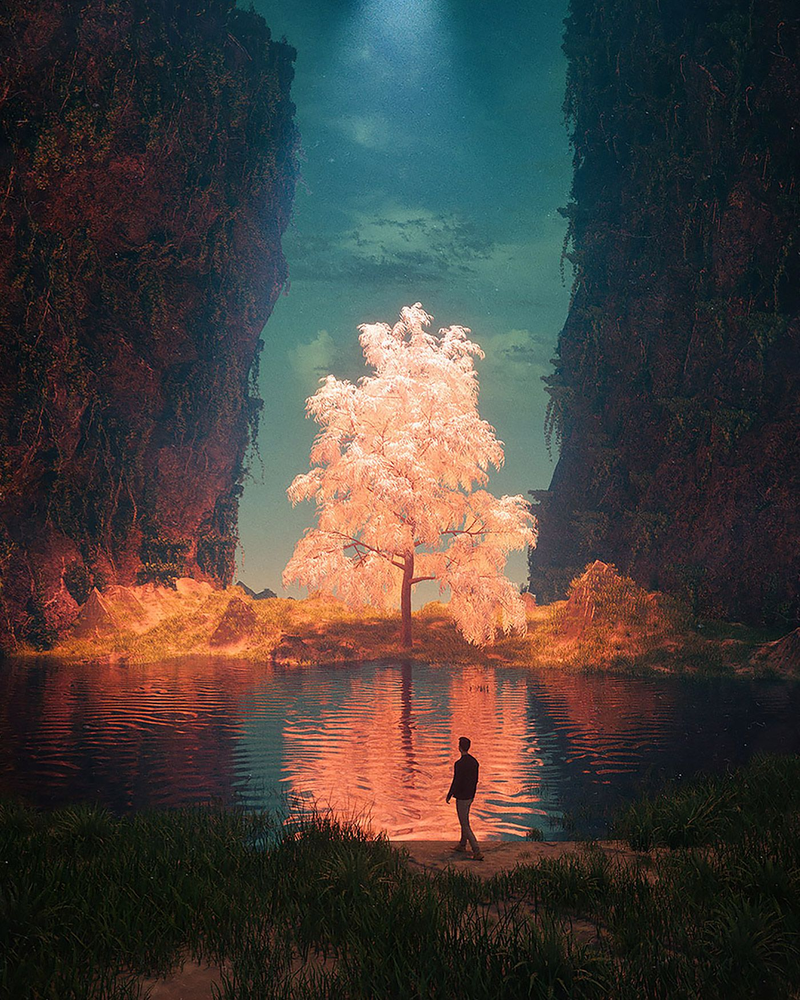

# Cyber

如果你来到这里，不妨读一读这段小故事。这个架空世界的过往。赛博过往。

## 起源

一名身着白大褂的男人静静的站在窗外，眼神凝视着隔离窗内的女孩。女孩口中插着氧气管，一旁的心电仪滴滴的响着。

心电图上的功率越发的慢了下来。但是女孩惨白的脸庞里，彷佛微微的动了起来。似乎在呼唤些什么。

“利兹，爸爸在这”

男子下意识的伸手想回应女孩。但触碰到的只有冰冷的玻璃。

男子咬了一下下嘴唇。

“利兹，放心睡吧。那个世界不可怕。醒来以后，爸爸妈妈都会在那里等你。”

话音刚落不久，心电图的浪波彻底消失了。留下的只有长长的一声“滴”。

男子回过头，还有.....另一个男人的身影。

------

## 孤儿

圣托利亚历1067年，洛恩帝国东境。

“康纳，汇报一下伤亡情况。”

“是，奥托殿下。我部阵亡27人，受伤56人。全歼敌部256人。目前正在打扫战场。”

“父亲那边有没有什么消息。”

“公爵大人并没有消息。按日子算。已经到了海港城了。”

奥托从马上取来一带水，喝了一大口。

战斗从昨夜一直打到早上，他已经是筋疲力竭了。

更何况他是长途奔袭。更是累的不行。但也正因为这一出奇兵，才获得这场战斗的大胜。

“算前两次的战斗，这次的东部叛乱算是解决了。”

不知是严重脱水的缘故，还是什么原因。恍惚之中，他看到远处的森林出现了一道白光。

他顺着白光而去。

白光最终停在了一棵苍天大树之下。

一个婴儿正在那里平静的睡着。

这一天，奥托收养了一个男孩。为他取名弗兰.维兹（白鹿之子）

------

## 分裂

圣托利亚历元年，巴别岛

托利亚和他的子女们做好了充足的准备，粮食，水源。登上了他们做好的船。

和梦里的所看见的一样。

天空开始撕裂，倾盆大雨从天而降。

大地开始撕裂，有罪的人们都陷了下去。

唯有他们的小船浮了上来。

遵照着指示，他们一直向东驶去。

如果远远望去，还能看见那高耸入天的高塔。无数的人跌落。

渐行渐远后，高塔消失在重重浓雾之下，再也看不到了。

------

## 狩猎

圣托利亚历1082年

只听的嗖的一声。一支利箭从灌木丛中飞出，命中目标。

“忠诚，快上。”一声坚决的命令随后传来。

紧接着，一只猎犬冲上去。扑倒了中箭的公鹿。

“太好了，叔父。抓住了。”一旁的传来了一名少年的欢呼。

一名气宇不凡的中年男子，放下手中的弓，摸了摸一旁少年的头。轻轻地说道

“弗兰，和我过来。”

紧接着男子走向公鹿，少年在一旁跟随着。

男子走到猎物跟前，跪在猎物面前，轻轻地祷告着：“感谢大自然给我们的恩赐。请安息吧”

少年在一旁也跟着做到。

待祷告完毕。男子，才取出匕首，捂住公鹿的双眼，结束了它的生命。

男子做完后，转而对少年说道

“永远要尊敬大自然。弗兰。你要知道，这不是应得的。是这片森林留给我们的。拿走的东西，你也要还给它些什么。”

------

## 兄弟

圣托利亚历13年

年迈的托利亚，弥留之际，回忆起了自己走过的一生。遵循着梦里一步一步的指示，离开了那个高塔，逃离洪水天灾。

来到了这块大陆。建立了自己的城市。

他叫来自己的三个儿子。

“法洛克，洛恩，萨斯。在我死后，你们各自向着大陆的三个方向搬迁。不要生活在一块，天灾来了，你们就不会都死亡。”

在父亲死后，三兄弟私下决定，大哥法洛克向西，老二洛恩向东，老三萨斯向南。他们分别带着自己的追随者建立了自己的城市。

------

## 蔷薇

法洛克一行人从托利亚城向西而去。

跨过山丘，丛林。

一路的奔波，让他们的粮食和水源都快耗尽了。

终于，他们来到了一处平原。

令他们无比惊叹的情景出现了。

横亘平原的有一条无比清澈的河。

河岸边有一棵苍天巨树，上面开满了金色的蔷薇花。

他们在河边取水，捕鱼。在树下乘凉。

有赖于这一苍天巨树。法洛克一行人得以活了下来。

他们决定留在此处。建立自己的家园。

------

## 恩惠

洛恩一行人向东而去。

他们在路上遇上了一只受伤的白鹿。

虽然粮食和药物并不多，他们还是选择帮助他。

然后继续向东而去。

但是，他们在一处丛林里迷路。

三天三夜。

身上带的水和粮食都吃完了。洛恩感到了绝望。

第三天夜里，洛恩从梦中醒来。他看到一只白光。

似乎在呼唤他，他跟随而去。

顺着白光，他找到了森林的出路。

看到了小溪和满是果实的果树。

洛恩带着族人而来，他们得救了。

洛恩相信这是那头白鹿的恩惠。他们在此处定居。

洛恩告诉自己的子嗣，要对森林永怀尊敬与感激。

危难来临时，白鹿会再次出现帮助他们。

------

## 海岸

萨斯一行人向南而去

南方河网密布

东方森林分布

西方平原广阔

萨斯沿途，遇水而捕。

食物与水源并不成问题

但是由于河网密集，他们行途困难。

一天，萨斯在渡过一条河的途中，遇到了水涡。

一行人被卷入水中，几乎淹死。

他们在慌忙中，抓住了一块木桩。惊奇的是，这只木桩竟然能承受住所有的人的重量。

由此他们得救了。他们由此开始研究这个木桩。

沿途的河边生长着许多这样的树。这样的木头，浮力极强。

萨斯决定定居于此，取此木为舟，得以在河网顺畅通行

------

## 遗落

神圣洛恩帝国，恩惠节。

洛恩为了纪念当年白鹿的恩惠。

每年秋季，夜空里那颗星达到最亮的时候。

洛恩国王召集各地的领主来到白鹿城。男人狩猎，女人摘果。

举办盛大的庆祝典礼。庆祝这个日子。

经过几百年的发展，这个节日逐渐也成为男人证明自己能力的节日。

收获最多的人，将在这天，在全国所有领主的见证下，得到国王的嘉奖。

圣托利亚历500年，也即托利亚来到新大陆的500年后。

国王洛恩十三世，年轻气盛。

为了证明自己的实力，在恩惠节这天，亲自参与狩猎。

狩猎当天，一只白鹿出现在他的眼前。

惊喜万分的他，追随着白鹿。

进入了深林的深处。

再也没有出来过。

由于没有子嗣，洛恩帝国丧失王位继承人。

当时的七个实力最强的领主将帝国分裂成七大王国。东面的波希米亚，普洛斯，西面的博戈蒂北面的洛林，南面的拜恩，以及东西两个非世俗国美茵兹、科尔。

民间流传着这样的传说，洛恩王接受白鹿的指引，前往了绝美的圣地。终有一天，王会骑着白鹿回到王国。

------

## 母亲

“殿下，这个孩子是？”康纳看着奥托抱着一个婴儿从森林深处回来。

“他叫弗兰.维兹。是白鹿带我找到他的。”

“您看到了白鹿？”康纳惊得楞了许久，随即又问道，

“但这个可能是叛军的人的孩子，要是被普洛斯王知道了，可就麻烦了，不如以绝后患”。

“康纳，这是白鹿的旨意。我注定要收养这个孩子。”奥托的语气里透露出坚定。

“是，属下明白了。”

“你去叫伊莲娜来。”奥托犹豫了一会，说道。

“是，我这就去找殿下。”

伊莲娜，军队里的女医师。当时西境之王博戈蒂国王的女儿。也是奥托的未婚妻。

不一会，一个女医师跟着康纳来到奥托身边。

“我那边还有很多伤员要处理。还请快些。有什么吩咐吗？奥托殿下。”女子显然是刚从治疗现场过来，白色衣服上沾了些许伤员的血。

“这个孩子，我能托付给你吗?”奥托看着手里的孩子，转而抬头对伊莲娜说道。

“这个孩子是？”

“白鹿之子。他的名字叫弗兰.维兹。”

女子从奥托手里接过孩子，轻轻地说道：“孩子，从今天开始。我就是你的母亲了。”

## 鹿灵

“过几天就是恩惠节了。弗兰，我不在的时候有好好练习吗？”

“放心吧，叔父。这些日子，我一直跟着康纳大人练习。”

“好，那接下来交给你了，由你来试试。”

说完，皇帝奥托将弓递给了这个金发少年。

少年的脸上露出了欣喜与兴奋。接过弓。

少年摸了摸一旁猎犬忠诚的头，让他嗅了嗅刚刚的鹿尸体。

随后忠诚开始侦探四周，向一处奔去。少年也跟着忠诚而去。

很难想象，一个少年竟然有如此的速度。以至于能跟的上成年的猎犬。

不一会。忠诚发现了一只野兔。就在他们不远处。

少年叫住了忠诚。让它不要惊动了兔子。因为以这样的距离，在靠近的话就会惊动了猎物。

少年晓得，自己并不能做无谓的追逐，而是等待，寻找时机狩猎。

少年深吸了一口气，从背后的箭筒里取出一支箭。粘弓搭箭。以迅雷不及掩耳的势头，瞄准放箭。

他敏锐的眼神里透露出坚定。

嗖。命中目标。

他顺势让忠诚冲过去，将猎物叼来。

就这样，他猎了许多猎物。

直到他在抓捕一只鹿的时候。

在粘弓搭箭的时候，他听到了声音：“求求你，不要伤害我”。

那一箭，他射偏了。

## 梦境

金发少年，提着弓在丛林里游走着。

“这里是，哪儿?”

少年在丛林里慢慢走着，但无论如何都无法走出森林。

敏锐的直觉让少年意识到前方不远处有动静。

下意识的提起了弓。“谁在哪里？”

“谢谢你，今天。”

一个人影从丛林的浓雾中走出。

少年一看，是一位身着白衣的少女。

“你不会放箭的对吗？今天就是你放走了我。”

少年放下了手中的弓，问道：“你是今天的小鹿？”。

仔细一看，少女一袭连衣白裙，银白色的发色。14-16岁上下的模样。

“没想到，你竟然能够听到我的声音。”少女说道。

“什么意思？”

“就是我在小鹿身上的时候，你竟然能听到我的声音。”

话音落闭，一只银白色的小鹿出现在少女身旁。

弗兰对这个小鹿有印象，不会有错。这是今天的小鹿，只不过毛色，变成了银白色的了。

“利兹。”少女摸着一旁的小鹿，轻轻说道

“什么？”

“那是我的名字。”

少年楞了一下，犹豫了一会，随后说道：

“弗兰，我的名字。”

少女听道少年的回应，甜甜地笑了，”无论如何，今天都要谢谢你“

随后与白鹿化做一道白光。消失在雾中。

